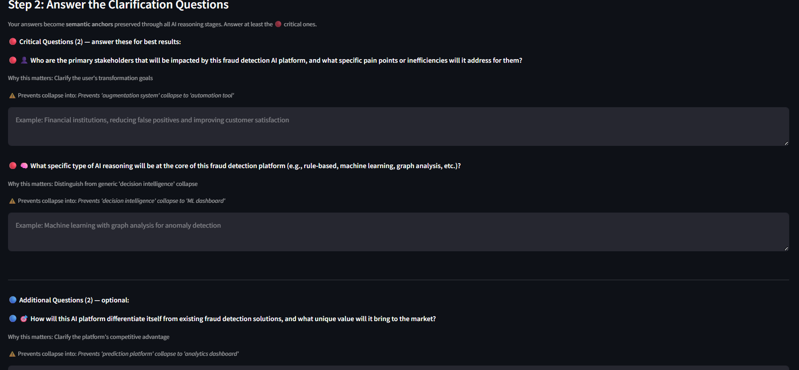
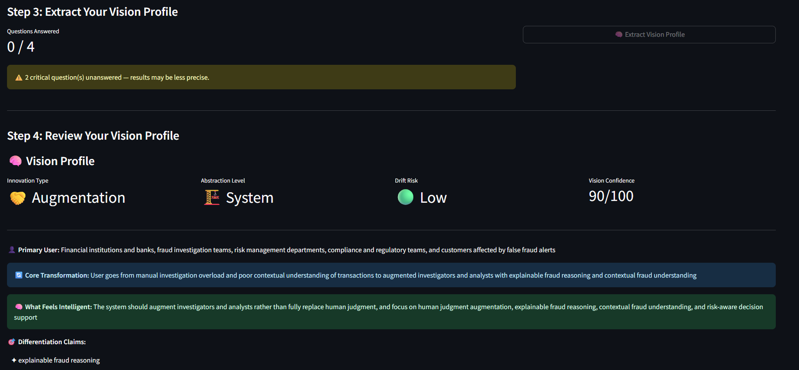
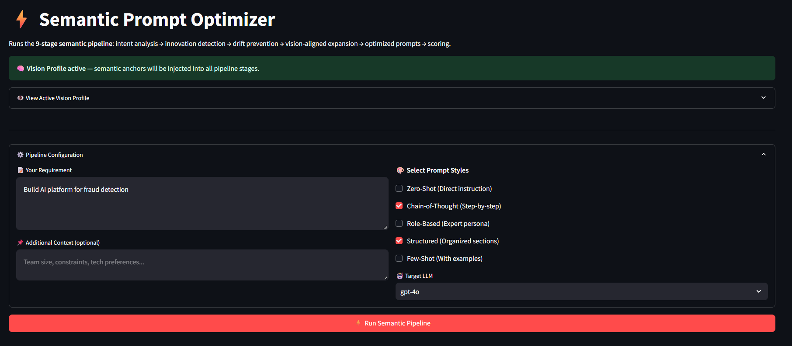
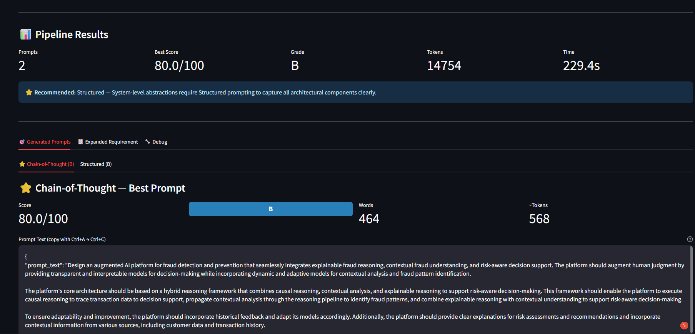

# AI Requirement Cognition Platform

> **An AI-powered Semantic Requirement Cognition and Operational Architecture Synthesis Platform** — designed to preserve conceptual intent, prevent semantic collapse, and synthesize domain-aware intelligence architectures from vague or incomplete AI/product ideas.

<p align="center">
  
</p>

---

## Table of Contents

1. [Project Overview](#1-project-overview)
2. [Problem Statement](#2-problem-statement)
3. [Core Innovation](#3-core-innovation)
4. [Key Features](#4-key-features)
5. [System Architecture](#5-system-architecture)
6. [Semantic Pipeline Flow](#6-semantic-pipeline-flow)
7. [Operational Intelligence Flow](#7-operational-intelligence-flow)
8. [Tech Stack](#8-tech-stack)
9. [Installation Guide](#9-installation-guide)
10. [Usage Guide](#10-usage-guide)
11. [Example Inputs & Outputs](#11-example-inputs--outputs)
12. [Screenshots](#12-screenshots)
13. [API Overview](#13-api-overview)
14. [Folder Structure](#14-folder-structure)
15. [Challenges Solved](#15-challenges-solved)
16. [Why This Project Is Different](#16-why-this-project-is-different)
17. [Future Improvements](#17-future-improvements)
18. [Deployment Instructions](#18-deployment-instructions)
19. [Resume Value / Learning Outcomes](#19-resume-value--learning-outcomes)
20. [Conclusion](#20-conclusion)

---

## 1. Project Overview

The **AI Requirement Cognition Platform** is a research-inspired, production-grade system that transforms vague or incomplete AI/product ideas into semantically grounded, operationally coherent, and explainable AI system architectures.

It is built around a **9-stage semantic reasoning pipeline** that performs:

- Intent analysis
- Innovation detection
- Semantic drift prevention
- Vision-aligned requirement expansion
- Prompt optimization and scoring

The platform is not a generic text generator. It is a **Semantic Requirement Intelligence System** that preserves the conceptual identity, abstraction fidelity, and innovation uniqueness of an idea — from raw input to synthesized architecture.

---

## 2. Problem Statement

When AI practitioners and product teams attempt to convert high-level ideas into implementable system designs, they face a fundamental problem: **semantic collapse**.

Standard tools and LLM pipelines routinely reduce nuanced, domain-specific ideas into generic patterns:

| Original Idea | Collapsed Result |
|---|---|
| "AI decision intelligence system" | "ML dashboard" |
| "Human-augmented fraud reasoning" | "Fraud detection API" |
| "Explainable causal reasoning engine" | "Analytics chatbot" |
| "Semantic requirement cognition" | "Prompt generator" |

This collapse destroys:
- Conceptual innovation
- Domain-specific differentiation
- Abstraction fidelity
- Operational uniqueness

The **AI Requirement Cognition Platform** solves this through semantic anchoring, anti-pattern detection, and vision-profile extraction — before any architecture synthesis occurs.

---

## 3. Core Innovation

The platform introduces a novel **Semantic Requirement Intelligence** model with the following core properties:

### Semantic Intent Preservation
Rather than immediately translating a requirement into a system design, the platform first extracts the **semantic anchors** — the irreducible conceptual units that define the innovation — and injects them into every downstream reasoning stage.

### Anti-Pattern-Aware Synthesis
The system identifies which generic software patterns a given idea might collapse into (e.g., "augmentation → automation tool") and actively prevents those collapses through structured clarification and reasoning alignment.

### Vision Profile Extraction
Before any pipeline runs, the system generates a **Vision Profile** — a structured semantic fingerprint of the user's idea that captures:
- Innovation type
- Abstraction level
- Drift risk score
- Vision confidence
- Core transformation goal
- Differentiation claims

### Operational Grounding
Synthesized architectures are not theoretical — they are grounded in operational context, domain-specific constraints, and causal reasoning flows.

---

## 4. Key Features

| Feature | Description |
|---|---|
| **Vision Clarifier** | Generates targeted clarification questions to extract semantic anchors before any reasoning begins |
| **Semantic Anchor Injection** | Vision profile anchors are propagated through all 9 pipeline stages |
| **Anti-Pattern Detection** | Identifies and prevents semantic collapse into known generic patterns |
| **9-Stage Semantic Pipeline** | Intent analysis → innovation detection → drift prevention → expansion → optimization → scoring |
| **Multi-Style Prompt Synthesis** | Generates Chain-of-Thought, Structured, Zero-Shot, Role-Based, and Few-Shot prompt variants |
| **Prompt Scoring Engine** | Evaluates generated prompts on semantic fidelity, clarity, operational grounding, and token efficiency |
| **Vision Profile Dashboard** | Visual summary of innovation type, abstraction level, drift risk, and confidence |
| **Drift Risk Assessment** | Quantifies how likely a requirement is to collapse into a generic pattern |
| **Causal Reasoning Synthesis** | Generates causal reasoning flows aligned to domain-specific operational contexts |
| **Explainable Architecture Output** | All synthesized architectures include reasoning traces and explanation layers |

---

## 5. System Architecture

```
┌─────────────────────────────────────────────────────────────────────────┐
│                     AI Requirement Cognition Platform                   │
├─────────────────────────────────────────────────────────────────────────┤
│                                                                         │
│   ┌──────────────┐        ┌──────────────────────────────────────────┐  │
│   │   Streamlit  │◄──────►│              FastAPI Backend             │  │
│   │   Frontend   │        │                                          │  │
│   └──────────────┘        │  ┌────────────────────────────────────┐  │  │
│                           │  │       Semantic Pipeline Engine     │  │  │
│                           │  │                                    │  │  │
│                           │  │  Stage 1: Intent Extraction        │  │  │
│                           │  │  Stage 2: Semantic Anchor Mining   │  │  │
│                           │  │  Stage 3: Anti-Pattern Detection   │  │  │
│                           │  │  Stage 4: Requirement Expansion    │  │  │
│                           │  │  Stage 5: Conceptual Synthesis     │  │  │
│                           │  │  Stage 6: Operational Grounding    │  │  │
│                           │  │  Stage 7: Reasoning Alignment      │  │  │
│                           │  │  Stage 8: Prompt Optimization      │  │  │
│                           │  │  Stage 9: Scoring & Evaluation     │  │  │
│                           │  └────────────────────────────────────┘  │  │
│                           │                                          │  │
│                           │  ┌────────────┐   ┌──────────────────┐  │  │
│                           │  │  Groq LLM  │   │    ChromaDB      │  │  │
│                           │  │ (via       │   │ (Semantic Memory) │  │  │
│                           │  │ LangChain) │   └──────────────────┘  │  │
│                           │  └────────────┘                         │  │
│                           │                                          │  │
│                           │  ┌────────────────────────────────────┐  │  │
│                           │  │         SQLAlchemy ORM             │  │  │
│                           │  │     (Session & State Store)        │  │  │
│                           │  └────────────────────────────────────┘  │  │
│                           └──────────────────────────────────────────┘  │
└─────────────────────────────────────────────────────────────────────────┘
```

---

## 6. Semantic Pipeline Flow

The platform's core reasoning pipeline consists of 9 sequential stages, each building on the semantic context established by prior stages.

```
Raw Requirement Input
        │
        ▼
┌───────────────────┐
│  Stage 1          │  ── Extracts primary intent, domain, and innovation signals
│  Intent Analysis  │
└────────┬──────────┘
         │
         ▼
┌────────────────────────┐
│  Stage 2               │  ── Identifies irreducible conceptual units (semantic anchors)
│  Semantic Anchor       │     that must be preserved through the pipeline
│  Extraction            │
└────────┬───────────────┘
         │
         ▼
┌────────────────────────┐
│  Stage 3               │  ── Maps known anti-patterns; flags collapse risks
│  Innovation            │     (e.g., "augmentation" → "automation")
│  Detection &           │
│  Anti-Pattern Guard    │
└────────┬───────────────┘
         │
         ▼
┌────────────────────────┐
│  Stage 4               │  ── Expands requirement into operationally rich description
│  Drift Prevention &    │     while injecting semantic anchors from Stage 2
│  Vision-Aligned        │
│  Expansion             │
└────────┬───────────────┘
         │
         ▼
┌────────────────────────┐
│  Stage 5               │  ── Synthesizes conceptual architecture components
│  Conceptual            │     aligned to domain and abstraction level
│  Synthesis             │
└────────┬───────────────┘
         │
         ▼
┌────────────────────────┐
│  Stage 6               │  ── Grounds synthesized concepts in operational contexts,
│  Operational           │     causal flows, and domain-specific constraints
│  Grounding             │
└────────┬───────────────┘
         │
         ▼
┌────────────────────────┐
│  Stage 7               │  ── Aligns generated reasoning with semantic invariants;
│  Reasoning             │     checks for semantic drift from original intent
│  Alignment             │
└────────┬───────────────┘
         │
         ▼
┌────────────────────────┐
│  Stage 8               │  ── Generates multi-style prompt variants (CoT, Structured,
│  Prompt Optimization   │     Zero-Shot, Role-Based, Few-Shot)
└────────┬───────────────┘
         │
         ▼
┌────────────────────────┐
│  Stage 9               │  ── Scores prompts on semantic fidelity, clarity,
│  Scoring &             │     operational grounding, and token efficiency
│  Evaluation            │
└────────┬───────────────┘
         │
         ▼
  Synthesized Architecture
  + Scored Prompt Variants
  + Vision Profile Report
```

---

## 7. Operational Intelligence Flow

```
User Idea
    │
    ▼
Vision Clarifier
    │  ── Generates targeted clarification questions
    │  ── Critical questions prevent specific collapse patterns
    │  ── Answers become semantic anchors
    │
    ▼
Vision Profile
    │  ── Innovation Type (e.g., Augmentation, Automation, Prediction)
    │  ── Abstraction Level (e.g., Feature, System, Platform)
    │  ── Drift Risk Score
    │  ── Vision Confidence (0–100)
    │  ── Core Transformation Goal
    │  ── Differentiation Claims
    │
    ▼
Semantic Pipeline
    │  ── Anchors injected at every stage
    │  ── Anti-patterns actively suppressed
    │
    ▼
Pipeline Results
    │  ── Multiple prompt variants generated
    │  ── Each scored and graded
    │  ── Best variant recommended with justification
    │  ── Token count and processing time reported
    │
    ▼
Synthesized AI Architecture
```

---

## 8. Tech Stack

| Layer | Technology | Purpose |
|---|---|---|
| **Frontend** | Streamlit | Interactive UI for requirement input, clarification, and result visualization |
| **Backend** | FastAPI | Async REST API server orchestrating pipeline stages |
| **LLM Provider** | Groq API | High-speed LLM inference for all reasoning stages |
| **LLM Orchestration** | LangChain | Chain construction, prompt templating, and pipeline management |
| **Semantic Memory** | ChromaDB | Vector store for semantic anchor retrieval and similarity search |
| **Data Modeling** | Pydantic | Strict schema validation for all pipeline inputs and outputs |
| **ORM / State** | SQLAlchemy | Session management and pipeline state persistence |
| **Async Runtime** | AsyncIO | Non-blocking pipeline execution across all stages |
| **Language** | Python 3.10+ | Core implementation language |

---

## 9. Installation Guide

### Prerequisites

- Python 3.10 or higher
- A [Groq API key](https://console.groq.com)
- Git

### Clone the Repository

```bash
git clone https://github.com/your-username/ai-requirement-cognition-platform.git
cd ai-requirement-cognition-platform
```

### Create a Virtual Environment

```bash
python -m venv venv
source venv/bin/activate        # Linux/macOS
venv\Scripts\activate           # Windows
```

### Install Dependencies

```bash
pip install -r requirements.txt
```

### Configure Environment Variables

```bash
cp .env.example .env
```

Edit `.env` and add your credentials:

```env
GROQ_API_KEY=your_groq_api_key_here
DATABASE_URL=sqlite:///./cognition.db
CHROMA_PERSIST_DIRECTORY=./chroma_store
```

### Initialize the Database

```bash
python -m app.db.init_db
```

---

## 10. Usage Guide

### Start the Backend API

```bash
uvicorn app.main:app --reload --host 0.0.0.0 --port 8000
```

### Start the Frontend

```bash
streamlit run frontend/app.py
```

Open your browser at `http://localhost:8501`.

### Using the Platform

**Step 1 — Vision Clarifier**

Navigate to the **Vision Clarifier** tab. Enter your AI idea or product concept. Click **Generate Clarification Questions**. The system will produce targeted critical and optional questions designed to extract semantic anchors.

**Step 2 — Answer Clarification Questions**

Answer the critical questions (marked in red). These answers become semantic anchors injected into all downstream pipeline stages. Anti-collapse warnings show exactly which generic patterns your answers prevent.

**Step 3 — Extract Vision Profile**

Click **Extract Vision Profile** to generate your semantic fingerprint, including innovation type, abstraction level, drift risk, and vision confidence score.

**Step 4 — Run Semantic Pipeline**

Navigate to the **Semantic Prompt Optimizer** tab. Your vision profile is automatically active. Select your desired prompt styles (Chain-of-Thought, Structured, etc.), choose a target LLM, and click **Run Semantic Pipeline**.

**Step 5 — Review Results**

Examine the generated prompt variants, their scores, token counts, and the system's recommended style. Use the **Expanded Requirement** and **Debug** tabs for deeper inspection.

---

## 11. Example Inputs & Outputs

### Input

```
Requirement: Build AI platform for fraud detection
```

### Vision Profile Output

```
Innovation Type     : Augmentation
Abstraction Level   : System
Drift Risk          : Low
Vision Confidence   : 90 / 100

Primary User        : Financial institutions, banks, fraud investigation
                      teams, risk management departments, compliance teams

Core Transformation : From manual investigation overload and poor contextual
                      understanding → to augmented investigators with
                      explainable fraud reasoning and contextual understanding

What Feels Intelligent:
  The system augments investigators rather than replacing human judgment,
  focusing on explainable fraud reasoning, contextual fraud understanding,
  and risk-aware decision support.

Differentiation Claims:
  ✦ Explainable fraud reasoning
  ✦ Human judgment augmentation
  ✦ Risk-aware decision support
```

### Pipeline Output (Best Prompt — Chain-of-Thought, Grade B)

```json
{
  "prompt_text": "Design an augmented AI platform for fraud detection and
  prevention that seamlessly integrates explainable fraud reasoning,
  contextual fraud understanding, and risk-aware decision support. The
  platform should augment human judgment by providing transparent and
  interpretable models for decision-making while incorporating dynamic
  and adaptive models for contextual analysis and fraud pattern
  identification.

  The platform's core architecture should be based on a hybrid reasoning
  framework that combines causal reasoning, contextual analysis, and
  explainable reasoning to support risk-aware decision-making..."
}
```

**Scores**

| Prompt Style | Score | Grade | Words | Tokens |
|---|---|---|---|---|
| Chain-of-Thought | 80.0 / 100 | B | 464 | 568 |
| Structured | 80.0 / 100 | B | — | — |

**Recommendation:** Structured — System-level abstractions require Structured prompting to capture all architectural components clearly.

---

## 12. Screenshots

### Vision Clarifier — Step 1: Describe Your Idea

> The Vision Clarifier prompts the user to describe their concept. The system explains *why* semantic anchoring matters — preventing "AI decision intelligence system" from collapsing into "ML dashboard."


---

### Vision Clarifier — Step 2: Answer Clarification Questions

> Critical questions are generated to prevent specific collapse patterns. Each question shows which anti-pattern it prevents (e.g., preventing 'augmentation system' collapse to 'automation tool').



---

### Vision Clarifier — Step 3 & 4: Vision Profile Extraction

> The extracted Vision Profile shows innovation type (Augmentation), abstraction level (System), drift risk (Low), and vision confidence (90/100) — along with core transformation goal and differentiation claims.



---

### Semantic Prompt Optimizer — Pipeline Configuration

> The optimizer tab showing the 9-stage semantic pipeline with Vision Profile active. Semantic anchors are injected into all pipeline stages automatically.



---

### Pipeline Results — Scored Prompt Variants

> Pipeline results showing 2 generated prompt variants, best score of 80/100 (Grade B), token consumption (14,754), and processing time (229.4s). The Chain-of-Thought variant is highlighted as best.



---

## 13. API Overview

The FastAPI backend exposes the following primary endpoints:

| Method | Endpoint | Description |
|---|---|---|
| `POST` | `/api/v1/vision/clarify` | Generate clarification questions for a given idea |
| `POST` | `/api/v1/vision/extract-profile` | Extract a Vision Profile from answered clarification questions |
| `GET` | `/api/v1/vision/profile` | Retrieve the active Vision Profile for the current session |
| `POST` | `/api/v1/pipeline/run` | Execute the full 9-stage semantic pipeline |
| `GET` | `/api/v1/pipeline/results/{session_id}` | Retrieve pipeline results by session |
| `GET` | `/api/v1/pipeline/status/{session_id}` | Check pipeline execution status |
| `POST` | `/api/v1/prompt/score` | Score a given prompt against semantic fidelity criteria |
| `GET` | `/api/v1/health` | Health check endpoint |

### Example API Request

```bash
curl -X POST http://localhost:8000/api/v1/vision/clarify \
  -H "Content-Type: application/json" \
  -d '{
    "requirement": "Build AI platform for fraud detection",
    "context": "For financial institutions"
  }'
```

### Example API Response

```json
{
  "session_id": "sess_abc123",
  "critical_questions": [
    {
      "question": "Who are the primary stakeholders impacted by this fraud detection AI platform?",
      "why_this_matters": "Clarifies the user transformation goals",
      "prevents_collapse_into": "Prevents 'augmentation system' collapse to 'automation tool'"
    }
  ],
  "additional_questions": [...]
}
```

---

## 14. Folder Structure

```
ai-requirement-cognition-platform/
│
├── app/                          # FastAPI backend application
│   ├── main.py                   # Application entry point
│   ├── api/                      # API route handlers
│   │   ├── v1/
│   │   │   ├── vision.py         # Vision Clarifier endpoints
│   │   │   ├── pipeline.py       # Semantic Pipeline endpoints
│   │   │   └── prompt.py         # Prompt scoring endpoints
│   ├── core/                     # Core pipeline modules
│   │   ├── intent_extractor.py   # Stage 1: Semantic intent extraction
│   │   ├── anchor_miner.py       # Stage 2: Semantic anchor mining
│   │   ├── antipattern.py        # Stage 3: Anti-pattern detection
│   │   ├── expander.py           # Stage 4: Requirement expansion
│   │   ├── synthesizer.py        # Stage 5: Conceptual synthesis
│   │   ├── grounder.py           # Stage 6: Operational grounding
│   │   ├── aligner.py            # Stage 7: Reasoning alignment
│   │   ├── optimizer.py          # Stage 8: Prompt optimization
│   │   └── scorer.py             # Stage 9: Scoring & evaluation
│   ├── db/                       # Database layer
│   │   ├── models.py             # SQLAlchemy ORM models
│   │   ├── session.py            # Database session management
│   │   └── init_db.py            # Database initialization
│   ├── schemas/                  # Pydantic schemas
│   │   ├── vision.py             # Vision Profile schemas
│   │   └── pipeline.py           # Pipeline I/O schemas
│   └── services/                 # Business logic services
│       ├── vision_service.py
│       └── pipeline_service.py
│
├── frontend/                     # Streamlit frontend
│   ├── app.py                    # Main Streamlit application
│   ├── pages/
│   │   ├── vision_clarifier.py   # Vision Clarifier UI
│   │   └── optimizer.py          # Semantic Prompt Optimizer UI
│   └── components/               # Reusable UI components
│
├── chroma_store/                 # ChromaDB vector persistence
├── screenshots/                  # UI screenshots for README
├── tests/                        # Unit and integration tests
├── .env.example                  # Environment variable template
├── requirements.txt              # Python dependencies
└── README.md
```

---

## 15. Challenges Solved

| Challenge | Solution |
|---|---|
| **Semantic Drift** | Vision Profile anchors injected at every pipeline stage to maintain conceptual consistency |
| **Conceptual Collapse** | Anti-pattern detection maps known collapse patterns and actively suppresses them during synthesis |
| **Abstraction Loss** | Abstraction level classification preserves the correct generalization depth throughout reasoning |
| **Prompt Redundancy** | Semantic compression removes redundant concepts before prompt generation |
| **Token Explosion** | Scoring engine penalizes token-inefficient outputs; compression stage reduces unnecessary verbosity |
| **Reasoning Fragmentation** | Causal reasoning synthesis connects all reasoning steps into coherent operational flows |
| **Orchestration Inefficiency** | AsyncIO-based pipeline execution reduces blocking; stages share semantic context via a shared session object |
| **Operational Grounding** | Dedicated grounding stage maps synthesized concepts to real operational constraints and domain context |
| **Anti-Pattern Preservation** | System maintains a registry of known AI system anti-patterns and cross-checks every synthesis output |

---

## 16. Why This Project Is Different

Most AI tools in this space fall into one of two categories:

**Category 1 — Prompt Generators**
Tools that take a simple input and produce a longer prompt. They have no understanding of semantic intent, no concept of abstraction levels, and no mechanism for preventing conceptual collapse.

**Category 2 — LLM Wrappers**
Systems that chain a few LLM calls together without structured reasoning alignment, semantic memory, or vision-profile grounding.

The **AI Requirement Cognition Platform** is architecturally distinct in three ways:

**1. Pre-Reasoning Semantic Extraction**
Before any generative reasoning occurs, the platform extracts a structured Vision Profile — a semantic fingerprint of the idea. This profile is the foundation for all downstream reasoning, not an afterthought.

**2. Anti-Pattern-Aware Synthesis**
The system explicitly knows which generic patterns an idea could collapse into — and actively prevents those collapses with targeted clarification, semantic anchoring, and reasoning alignment.

**3. Grounded Operational Output**
The synthesized architectures are not abstract descriptions. They are operationally grounded, causally reasoned, and domain-aware — aligned to the specific context of the original idea, not a generic version of it.

---

## 17. Future Improvements

| Improvement | Description |
|---|---|
| **Multi-Session Memory** | Persist Vision Profiles across sessions; allow iterative refinement over multiple interactions |
| **Domain Library** | Pre-built semantic anchor libraries for common domains (healthcare, fintech, logistics, legal) |
| **Architecture Diagram Export** | Auto-generate system architecture diagrams (Mermaid/PlantUML) from synthesized outputs |
| **Collaborative Mode** | Multi-user sessions where teams can collaboratively refine requirements and vision profiles |
| **Drift Monitoring Dashboard** | Real-time monitoring of semantic drift across pipeline stages with visual alerts |
| **Custom Anti-Pattern Registry** | Allow organizations to define their own known anti-patterns and collapse risks |
| **Model Comparison** | Run the same requirement through multiple LLM providers and compare semantic fidelity scores |
| **RAG Integration** | Retrieval-Augmented Generation using domain-specific knowledge bases for grounding |
| **Evaluation Benchmarks** | Formal semantic fidelity benchmarks to measure system performance across requirement types |

---

## 18. Deployment Instructions

### Docker Deployment

```dockerfile
# Dockerfile
FROM python:3.11-slim

WORKDIR /app
COPY requirements.txt .
RUN pip install --no-cache-dir -r requirements.txt

COPY . .
EXPOSE 8000

CMD ["uvicorn", "app.main:app", "--host", "0.0.0.0", "--port", "8000"]
```

```bash
# Build and run
docker build -t ai-requirement-cognition .
docker run -p 8000:8000 --env-file .env ai-requirement-cognition
```

### Docker Compose (Full Stack)

```yaml
# docker-compose.yml
version: "3.9"

services:
  backend:
    build: .
    ports:
      - "8000:8000"
    env_file:
      - .env
    volumes:
      - ./chroma_store:/app/chroma_store

  frontend:
    build:
      context: .
      dockerfile: Dockerfile.frontend
    ports:
      - "8501:8501"
    environment:
      - API_URL=http://backend:8000
    depends_on:
      - backend
```

```bash
docker-compose up --build
```

### Cloud Deployment

The backend FastAPI service can be deployed to any cloud platform supporting containerized Python workloads (AWS ECS, Google Cloud Run, Azure Container Apps). The Streamlit frontend can be deployed to Streamlit Community Cloud or containerized alongside the backend.

---

## 19. Resume Value / Learning Outcomes

Building and studying this platform develops competency in the following advanced engineering areas:

| Skill Area | What You Learn |
|---|---|
| **Semantic AI Engineering** | Designing reasoning systems that preserve conceptual intent through multi-stage pipelines |
| **LLM Orchestration** | Chaining LangChain components with stateful context propagation across 9 pipeline stages |
| **FastAPI Architecture** | Building async, schema-validated REST APIs with Pydantic and SQLAlchemy |
| **Vector Databases** | Using ChromaDB for semantic memory, anchor retrieval, and similarity-based grounding |
| **Prompt Engineering** | Advanced multi-style prompt synthesis, scoring, and semantic fidelity evaluation |
| **Anti-Pattern Detection** | Designing classifier systems that recognize and suppress known reasoning failure modes |
| **System Design** | Full-stack AI platform architecture from frontend interaction to vector-grounded inference |
| **Operational AI** | Grounding abstract AI concepts in domain-specific operational contexts |
| **Research Engineering** | Translating research concepts (semantic drift, conceptual collapse) into production systems |

---

## 20. Conclusion

The **AI Requirement Cognition Platform** addresses a fundamental gap in AI tooling: the inability of standard systems to preserve the conceptual identity of an idea through the reasoning pipeline.

By introducing structured **Vision Profile extraction**, **semantic anchor injection**, and **anti-pattern-aware synthesis**, the platform ensures that what emerges from the pipeline is a true operational amplification of the original idea — not a generic reduction of it.

This is not a prompt generator. It is a **Semantic Requirement Intelligence System** — one that treats the conceptual integrity of an idea as a first-class engineering concern.

---

<p align="center">
  Built with precision. Designed for cognition.
</p>
